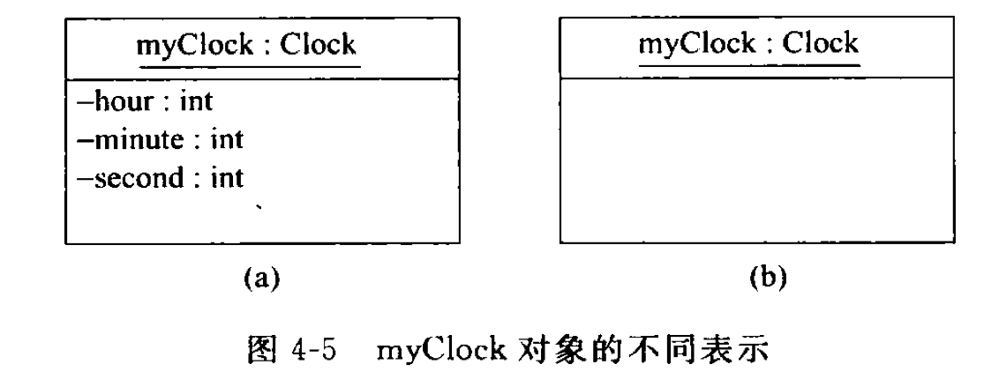
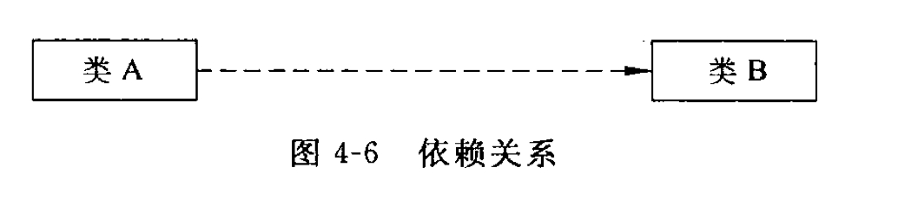
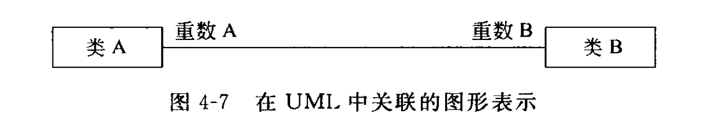
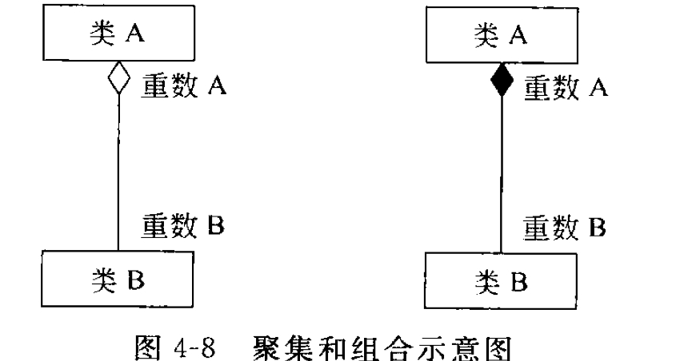

## 定义
一种典型的对象建模语言,里用符号描述概念,概念间的关系描述为连接符号的线.
## 要素
### 类图与对象图
1.**类图**:由类与之相关的静态关系组成的图形,可以有多个对象.  
2.**对象图**:包含了对象,没有类的类图.  
3.**类**:由上到下分为3段的矩形表示.  
**(类名(*必有*),属性,操作)**

**数据成员**  
private(访问控制符) name(名称:**必须**) :String(:类型) ="未署名" (=默认值)   
控制符:$Public$--**+**;$private$--**-**;$protected$--**#**;  
**函数成员**  
public(访问控制符) setTime(int h,int m,int s)(名称(参数表)) :void (:返回类型);  
4.**对象**:对象名必须带有类名前缀
  
### 集中关系的图形标识
1.依赖关系:一个事物的变化会影响到使用它的另一个事物.(类之间的调用,友元关系,类的实例化);  
  
2.关联关系:两个类相互作用;
  
3.包含关系:  
类或对象之间的包含关系:聚集与组合;  
聚集:共享聚集(部分可以参与多个整体),组成聚集(部分与整体共存);  
组合:组成聚集;  

4.泛化:类之间的继承关系;直线加三角形,三角形在被继承的类那边.
                                                                                                                                                                                                       